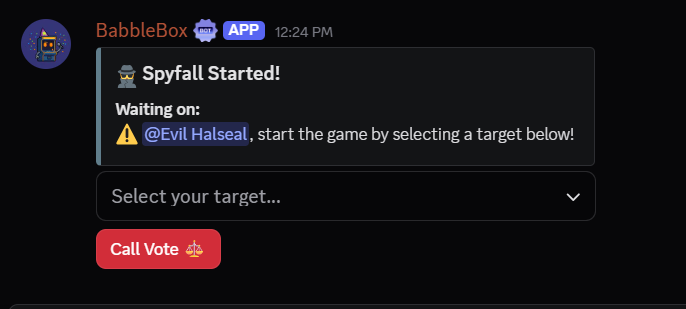
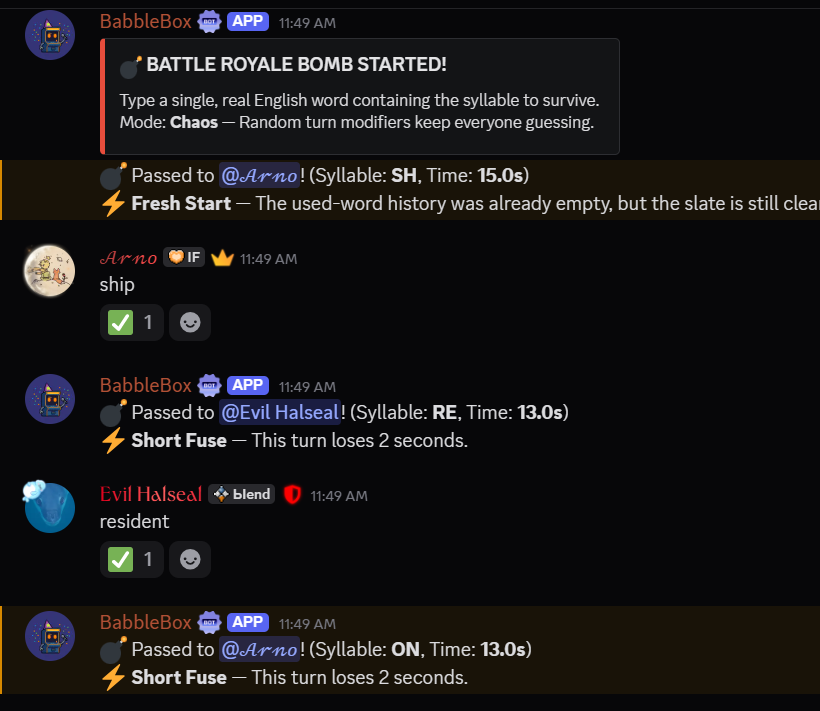
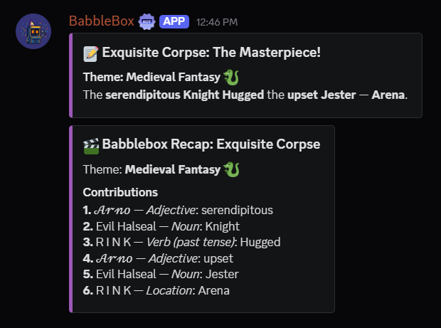

# Babblebox

Babblebox is a modular Discord bot built with Python and `discord.py`.

It is designed around five clear product lanes:

- Party Games for active voice/text hangouts
- Everyday Utilities for quiet server life
- Daily Arcade for low-player-count return visits
- Buddy / Profile / Vault for identity, streaks, and showable progress
- Babblebox Shield plus compact admin lifecycle helpers for lightweight, configurable server safety

Babblebox is intentionally compact:

- no economy grind
- no lootboxes
- no production JSON persistence for durable systems
- no blob/media archives in the database
- no always-on external AI scanning; Shield AI assist is optional and only reviews already-flagged messages

## Official Links

- Official website: [https://arno-create.github.io/babblebox-bot/](https://arno-create.github.io/babblebox-bot/)
- Privacy Policy: [https://arno-create.github.io/babblebox-bot/privacy.html](https://arno-create.github.io/babblebox-bot/privacy.html)
- Terms of Service: [https://arno-create.github.io/babblebox-bot/terms.html](https://arno-create.github.io/babblebox-bot/terms.html)
- Invite link: [https://discord.com/oauth2/authorize?client_id=1480903089518022739](https://discord.com/oauth2/authorize?client_id=1480903089518022739)
- GitHub repository: [https://github.com/arno-create/babblebox-bot](https://github.com/arno-create/babblebox-bot)
- Support server: [https://discord.com/servers/inevitable-friendship-1322933864360050688](https://discord.com/servers/inevitable-friendship-1322933864360050688)

## Product Overview

### Party Games

- Broken Telephone
- Exquisite Corpse
- Spyfall
- Word Bomb
- Chaos Cards and bomb mode variants
- hybrid slash + `bb!` prefix support
- session stats and session leaderboard commands

### Everyday Utilities

- Watch V2
  - separate mention alerts
  - separate reply alerts
  - keyword alerts
  - global, server, or channel scope
  - ignored channels
  - ignored users
  - DM-only delivery with cooldowns and dedupe
- Later
  - one saved reading marker per user per channel
  - media-aware previews
- Capture
  - DM transcript snapshots of recent messages
  - better media placeholders and attachment context
- Moment Cards
  - live-linked keepsake cards for a message or exchange
  - built from replies, recent messages, or message links
  - no archive table and no generated image pipeline
- Remind
  - safe one-time reminders with small active limits
- AFK
  - immediate, scheduled, or recurring away status
  - timezone-aware `start_at` and recurring local clock scheduling
  - preset reasons with default durations for common routines
  - duration parsing for `30m`, `2h`, `2d`, and compact combos like `1h30m`
  - elapsed and return-time messaging

### Shield / Safety

- Babblebox Shield
  - optional, admin-configurable moderation layer
  - admin-only configuration for administrators or Manage Server users
  - privacy leak pack
  - promo / invite pack
  - scam / malicious-link heuristic pack
  - optional AI-assisted second-pass review for moderator context only
  - AI stays off by default and is currently limited to guild `1322933864360050688`
  - log-first defaults
  - trusted-role bypass
  - included / excluded scope controls
  - allowlists for domains, invite codes, and phrases
  - compact advanced patterns with `contains`, `word`, and safe `wildcard` matching
  - raw custom regex intentionally unsupported to avoid unsafe hot-path backtracking
- Admin lifecycle helpers
  - returned-after-ban follow-up role assignment within a clear 30-day return window
  - auto-remove or moderator-review follow-up role expiry
  - review alerts with compact action buttons instead of a case system
  - verification retention with warning-before-kick cleanup
  - verification-help channel deadline extensions with a small extension cap
  - shared exclusions, trusted-role bypasses, templates, and compact admin logs

### Daily Arcade

Babblebox Daily is now a small arcade instead of one booth.

Current daily modes:

- Shuffle Booth
  - unscramble the word
- Emoji Booth
  - decode the emoji clue
- Signal Booth
  - decode a shifted word

Daily Arcade design rules:

- deterministic generation from the UTC date
- one compact result row per `user + date + mode`
- small attempt limits
- shareable output
- no external content APIs
- raw rows pruned after 180 days
- streaks and lifetime totals stay in the profile row

### Buddy / Profile / Vault

- one lightweight Buddy per user
- cosmetic style + nickname + mood + title + featured badge
- XP and level progression tied to actual use
- anti-farm per-day XP caps by category
- `/profile` is public-friendly by default
- `/vault` stays the more personal snapshot

## Commands

Slash commands and the `bb!` prefix both work.

### Core

| Slash | Prefix | Purpose |
| --- | --- | --- |
| `/help` | `bb!help` | Open the in-bot manual |
| `/ping` | `bb!ping` | Health check |
| `/play` | `bb!play` | Open a game lobby |
| `/stop` | `bb!stop` | Force stop the active lobby/game |
| `/vote` | `bb!vote` | Trigger a Spyfall vote |
| `/stats` | `bb!stats` | Session stats |
| `/leaderboard` | `bb!leaderboard` | Session leaderboard |
| `/chaoscard` | `bb!chaoscard` | Cycle or inspect the lobby Chaos Card |

### Party Games

Party game flow still starts from `/play`.

- Broken Telephone: 3+ players
- Exquisite Corpse: 3+ players
- Spyfall: 3+ players
- Word Bomb: 2+ players

Babblebox now nudges solo users toward Daily Arcade, Buddy, Profile, and utilities instead of leaving them at dead ends.

### Everyday Utilities

| Slash | Prefix | Purpose |
| --- | --- | --- |
| `/watch mentions` | `bb!watch mentions` | Toggle mention alerts by channel, server, or global scope |
| `/watch replies` | `bb!watch replies` | Toggle reply alerts separately from mentions |
| `/watch keyword add` | `bb!watch keyword add channel contains camera` | Add a watched keyword in channel/server/global scope |
| `/watch keyword remove` | `bb!watch keyword remove server camera` | Remove a watched keyword |
| `/watch ignore channel` | `bb!watch ignore channel` | Exclude the current channel from Watch |
| `/watch ignore user` | `bb!watch ignore user @name` | Ignore one user's messages in Watch |
| `/watch list` | `bb!watch list` | See keyword buckets and focused channels |
| `/watch settings` | `bb!watch settings` | See mention/reply states, ignore lists, and recent counts |
| `/watch off` | `bb!watch off server` | Clear watch settings by scope |
| `/later mark` | `bb!later mark` | Save your current reading spot |
| `/later list` | `bb!later list` | List saved markers |
| `/later clear` | `bb!later clear here` | Clear markers |
| `/capture` | `bb!capture 10` | DM yourself a recent-message snapshot |
| `/moment create` | `bb!moment create <message_link>` | Create a Moment Card from a message |
| `/moment from-reply` | `bb!moment from-reply` | Create a Moment Card from the replied message |
| `/moment recent` | `bb!moment recent` | Create a Moment Card from the latest channel moment |
| `/remind set` | `bb!remind set 2h dm take a break` | Create a reminder |
| `/remind list` | `bb!remind list` | Review active reminders |
| `/remind cancel` | `bb!remind cancel <id>` | Cancel a reminder |
| `/afk` | `bb!afk` | Set, schedule, or clear AFK |
| `/afkstatus` | `bb!afkstatus` | View AFK status |
| `/afktimezone set` | `bb!afktimezone set UTC+04:00` | Save your AFK timezone |
| `/afktimezone view` | `bb!afktimezone view` | View your AFK timezone |
| `/afkschedule add` | `bb!afkschedule add daily 23:30` | Create a recurring AFK schedule |
| `/afkschedule list` | `bb!afkschedule list` | Review recurring AFK schedules |
| `/afkschedule remove` | `bb!afkschedule remove <id>` | Remove a recurring AFK schedule |

AFK examples:

- `/afk focus 30m`
- `/afk preset:sleeping`
- `/afk start_at:23:00 preset:sleeping`
- `/afktimezone set America/New_York`
- `/afkschedule add repeat:weekdays at:18:00 preset:studying`
- `bb!afk deep work 1h30m`

### Shield / Safety

Shield commands are private/admin-facing by default. The streamlined slash surface is centered on `/shield panel`.

| Slash | Prefix | Purpose |
| --- | --- | --- |
| `/shield panel` | `bb!shield panel` | Open the Shield admin panel |
| `/shield rules` | `bb!shield rules pack promo enabled true action log sensitivity normal` | Configure module, packs, and escalation |
| `/shield logs` | `bb!shield logs #shield-log @Mods` | Set the mod-log channel and optional alert role |
| `/shield filters` | `bb!shield filters only_included trusted_role_ids on @Mods` | Tune scope, includes, excludes, and trusted roles |
| `/shield allowlist` | `bb!shield allowlist allow_domains on example.com` | Manage domain, invite, and phrase allowlists |
| `/shield ai` | `bb!shield ai true high true false true` | Configure optional AI second-pass review |
| `/shield advanced add` | `bb!shield advanced add Gift claim*gift wildcard log` | Add a safe advanced pattern |
| `/shield advanced list` | `bb!shield advanced list` | Review advanced patterns |
| `/shield test` | `bb!shield test free nitro claim now https://bit.ly/x` | Dry-run a message through Shield |

### Admin Lifecycle

Admin lifecycle commands are private/admin-facing by default. The streamlined surface is centered on `/admin panel`.

| Slash | Prefix | Purpose |
| --- | --- | --- |
| `/admin panel` | `bb!admin panel` | Open the admin lifecycle control panel |
| `/admin status` | `bb!admin status` | View overview counts or inspect one member |
| `/admin followup` | `bb!admin followup enabled true @Probation review 30d` | Configure returned-after-ban follow-up roles |
| `/admin verification` | `bb!admin verification enabled true @Verified must_have_role 7d 2d` | Configure warning-before-kick verification cleanup |
| `/admin logs` | `bb!admin logs #admin-log @Mods` | Set the shared admin log channel and alert role |
| `/admin exclusions` | `bb!admin exclusions trusted_role_ids on @Mods` | Configure shared exclusions and trusted roles |
| `/admin templates` | `bb!admin templates invite_link https://discord.gg/example` | Configure warning/kick DMs and optional rejoin link |
| `/admin sync` | `bb!admin sync` | One-time catch-up scan for current unverified members |

### Daily Arcade

| Slash | Prefix | Purpose |
| --- | --- | --- |
| `/daily` | `bb!daily` | Open today's public-friendly arcade overview |
| `/daily play <guess>` | `bb!daily play <guess>` | Open or play the default Shuffle Booth |
| `/daily play emoji <guess>` | `bb!daily play emoji <guess>` | Play Emoji Booth |
| `/daily play signal <guess>` | `bb!daily play signal <guess>` | Play Signal Booth |
| `/daily stats` | `bb!daily stats` | View compact arcade streaks and recent runs |
| `/daily share` | `bb!daily share` | Share a completed booth result |
| `/daily leaderboard` | `bb!daily leaderboard` | View arcade standings |

Daily visibility notes:

- `/daily`, `/daily play`, and `/daily stats` now default to public showable cards
- choose `visibility: private` whenever you want the old only-you flow
- cooldowns only apply to real public cards; storage errors, validation issues, state mismatches, and cooldown warnings stay private
- public Daily cards stay spoiler-safe and do not reveal failed answers in-channel

### Buddy / Profile / Vault

| Slash | Prefix | Purpose |
| --- | --- | --- |
| `/buddy` | `bb!buddy` | Open your Buddy card |
| `/buddy profile` | `bb!buddy profile` | Re-open the Buddy card explicitly |
| `/buddy rename` | `bb!buddy rename Pebble` | Rename your Buddy |
| `/buddy style` | `bb!buddy style sunset` | Change Buddy style |
| `/buddy stats` | `bb!buddy stats` | View Buddy progression |
| `/profile` | `bb!profile` | View a public-friendly profile card |
| `/vault` | `bb!vault` | Open your more personal vault view |

## Watch V2 Notes

Watch now distinguishes three alert types:

- mentions
- replies
- keywords

Important rules:

- replies only trigger when someone replies to a message owned by the watched user
- bots, webhooks, and self-messages are ignored
- delivery stays DM-only
- dedupe and cooldown protection stay in place
- no message-content archive is stored
- recent counts in settings are runtime-only, not a long-term inbox table

## Visibility Defaults

Babblebox now treats visibility more intentionally:

- public by default for `/help`, `/profile`, `/buddy`, `/daily`, `/daily play`, `/daily stats`, `/daily share`, and `/daily leaderboard`
- public-friendly card outputs keep light user/channel cooldowns to avoid spam
- private by default for Watch setup, reminders, Later, Capture, Shield config, and other sensitive utilities
- if a command exposes a `visibility` option, public mode now routes through a real visible channel response instead of silently collapsing to only-you

## Shield Notes

Babblebox Shield is intentionally compact and conservative:

- off until an admin enables it
- no deleted-message archive table
- no full message-body retention in Postgres
- moderator context goes to a configured log channel instead of a heavy database log
- repeated-hit escalation is in-memory and bounded
- custom regex is intentionally not accepted; advanced mode uses safe text matching only
- optional AI review never becomes the primary moderation engine
- AI review only runs after local Shield already flagged a message
- AI review is currently limited to guild `1322933864360050688`
- AI review is admin-only, off by default, and never punishes by itself
- only minimal, sanitized, truncated flagged content is sent to the AI provider

## Capture and Later Media Handling

Capture and Later now treat attachment-only messages more cleanly.

Examples:

- `[image: cat.png]`
- `[video: clip.mp4]`
- `[attachment: notes.pdf]`
- `[media: 2 images, 1 file]`

Important rules:

- no media blobs are stored in Postgres
- attachment URLs are only used at send time when available
- Capture transcripts are delivered privately, not archived long-term

## Daily Arcade Storage Discipline

Babblebox is designed for a small free-tier Postgres budget.

### Persistent identity row

- `bb_user_profiles`
  - one row per user
  - buddy identity
  - XP
  - streaks
  - aggregate counters

### Daily raw rows

- `bb_daily_results`
  - one row per `user + date + mode`
  - attempts
  - solved flag
  - timestamps
  - solve time

Retention:

- raw Daily Arcade rows prune after 180 days
- streaks and lifetime totals remain in `bb_user_profiles`

### Utility persistence

Utility persistence remains Postgres-first:

- `utility_watch_configs`
- `utility_watch_keywords`
- `utility_later_markers`
- `utility_reminders`
- `utility_afk`

New Watch V2 storage stays compact:

- booleans for global mention/reply alerts
- small JSON arrays for guild/channel filters
- small JSON arrays for ignored channels/users
- compact keyword rows with optional guild/channel scope

### Shield persistence

Shield stays config-only and compact:

- `shield_guild_configs`
- `shield_custom_patterns`

Stored data is intentionally small:

- module and pack enabled flags
- action modes and sensitivities
- AI enabled state, AI confidence threshold, and AI-eligible pack choices
- compact include / exclude / trusted lists
- compact allowlists
- escalation thresholds
- safe advanced pattern metadata

Not stored:

- full moderation event logs
- deleted-message bodies
- raw AI-submitted message bodies in Shield persistence
- attachment blobs
- large strike archives

### Admin lifecycle persistence

Admin lifecycle storage stays row-based and compact:

- `admin_guild_configs`
- `admin_ban_return_candidates`
- `admin_followup_roles`
- `admin_verification_states`

Stored data is intentionally small:

- one shared config row per guild
- short-lived ban-return candidates with a 30-day purge window
- active follow-up role rows only while Babblebox still manages that follow-up
- pending verification rows only while someone is still unverified
- review message IDs only while a moderator review is currently pending

Not stored:

- Babblebox ban / kick / timeout case history
- full join / leave archives
- per-member scheduler tasks
- long-term punishment event logs
- message transcripts or DM bodies

### Moment Cards

Moment Cards do not introduce a durable archive table.

- no stored generated images
- no stored quote feed
- no stored full message transcripts
- cards are built live from visible Discord messages

## Architecture

```text
.
|-- babblebox/
|   |-- __init__.py
|   |-- admin_service.py
|   |-- admin_store.py
|   |-- bot.py
|   |-- command_utils.py
|   |-- daily_challenges.py
|   |-- game_engine.py
|   |-- profile_service.py
|   |-- profile_store.py
|   |-- shield_ai.py
|   |-- shield_service.py
|   |-- shield_store.py
|   |-- text_safety.py
|   |-- utility_helpers.py
|   |-- utility_service.py
|   |-- utility_store.py
|   |-- web.py
|   `-- cogs/
|       |-- __init__.py
|       |-- afk.py
|       |-- admin.py
|       |-- events.py
|       |-- gameplay.py
|       |-- identity.py
|       |-- meta.py
|       |-- shield.py
|       `-- utilities.py
|-- assets/
|-- tests/
|-- index.html
|-- main.py
`-- requirements.txt
```

### Important modules

- `babblebox/bot.py`: bot bootstrap, extension loading, dictionary setup, sync
- `babblebox/game_engine.py`: lobby state, gameplay flow, recaps, help/manual, session stats
- `babblebox/utility_store.py`: Postgres-first utility persistence, including Watch V2 schema
- `babblebox/utility_service.py`: Watch, Later, Capture, Moment, Remind, AFK orchestration
- `babblebox/utility_helpers.py`: utility preview rendering, transcript formatting, and Moment Card embeds
- `babblebox/daily_challenges.py`: deterministic Daily Arcade booth generation
- `babblebox/profile_store.py`: compact profile and daily persistence
- `babblebox/profile_service.py`: Daily Arcade, Buddy, Profile, Vault, and anti-farm progression
- `babblebox/admin_store.py`: compact admin lifecycle config and pending-state persistence
- `babblebox/admin_service.py`: returned-after-ban follow-up logic, verification cleanup, and bounded sweeping
- `babblebox/shield_ai.py`: optional AI provider integration, redaction, truncation, and safe parsing
- `babblebox/shield_store.py`: compact Shield config persistence
- `babblebox/shield_service.py`: Shield matching, cache rebuilds, actions, and mod-log delivery
- `babblebox/cogs/admin.py`: admin-facing lifecycle panel, grouped commands, and review buttons
- `babblebox/cogs/identity.py`: Daily Arcade, Buddy, Profile, and Vault commands
- `babblebox/cogs/shield.py`: admin-facing Shield command surface
- `babblebox/cogs/utilities.py`: Watch V2, Later, Capture, Moment, and Remind commands

## Hosting Notes

Babblebox is designed for constrained hosting:

- no giant analytics tables
- no media/blob storage
- no giant inventory or economy loops
- no external Daily APIs
- small connection pools
- limited background scheduling
- deterministic Daily generation from local data

## Setup

### Requirements

- Python 3.9+
- a Discord bot token
- a `.env` file in the project root
- Postgres for durable storage-backed features

### Install

```bash
git clone https://github.com/arno-create/babblebox-bot.git
cd babblebox-bot
pip install -r requirements.txt
```

### Environment

```env
DISCORD_TOKEN=your_bot_token_here
DEV_GUILD_ID=your_test_server_id_here
UTILITY_DATABASE_URL=postgresql://...
# or SUPABASE_DB_URL=postgresql://...
# or DATABASE_URL=postgresql://...
OPENAI_API_KEY=sk-...
# optional Shield AI tuning:
# SHIELD_AI_MODEL=gpt-4.1-mini
# SHIELD_AI_TIMEOUT_SECONDS=4
# SHIELD_AI_MAX_CHARS=340

# optional local/test override:
# UTILITY_STORAGE_BACKEND=memory
# ADMIN_STORAGE_BACKEND=memory
# SHIELD_STORAGE_BACKEND=memory
# PROFILE_STORAGE_BACKEND=memory
```

Environment variable notes:

- `DISCORD_TOKEN` is required
- `DEV_GUILD_ID` is optional and helps faster dev sync
- `UTILITY_DATABASE_URL` is the preferred Postgres connection string
- `SUPABASE_DB_URL` and `DATABASE_URL` are also accepted
- `OPENAI_API_KEY` is optional and only needed for Shield AI assist
- `SHIELD_AI_MODEL`, `SHIELD_AI_TIMEOUT_SECONDS`, and `SHIELD_AI_MAX_CHARS` are optional Shield AI tuning knobs
- `UTILITY_STORAGE_BACKEND=memory` is for explicit local/test work only
- `ADMIN_STORAGE_BACKEND=memory` is optional for local/test admin lifecycle work
- `SHIELD_STORAGE_BACKEND=memory` is optional for local/test Shield work
- `PROFILE_STORAGE_BACKEND=memory` is optional for tests and local development

### Discord Portal Settings

Enable:

- Message Content Intent
- Server Members Intent

### Run

```bash
python main.py
```

## Recommended Permissions

- View Channels
- Send Messages
- Embed Links
- Attach Files
- Read Message History
- Add Reactions

## DM Requirement

These features rely on DMs being open:

- Broken Telephone
- Exquisite Corpse
- Spyfall role messages
- Watch alerts
- Later markers
- Capture transcripts
- DM reminders

## Screenshots

### Lobby


### Spyfall Voting



### Word Bomb



### Exquisite Corpse


