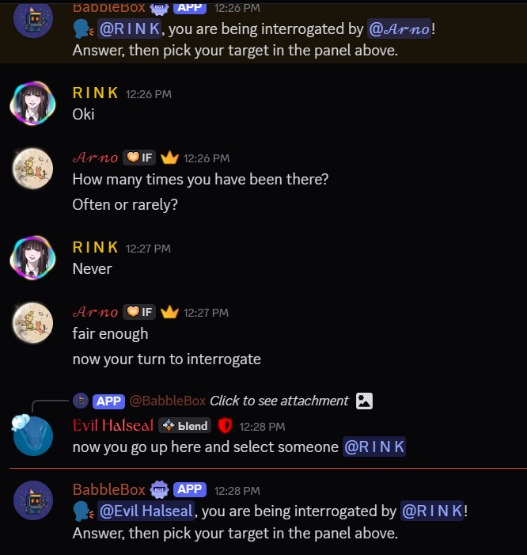

# Babblebox

**Babblebox** is a multiplayer Discord party game bot built with Python and `discord.py`.
It is designed around chaotic social games, smooth slash-command flows, and reliable async behavior across multiple servers.

## Highlights

- Four built-in multiplayer party games
- Slash-command based Discord UX
- Custom interactive `discord.ui.View` interfaces
- DM and server hybrid gameplay flows
- Guild-scoped game lifecycle management
- Defensive cleanup for timeouts, exits, and stale interactions
- Render-friendly deployment with a lightweight keep-alive endpoint

## Included Games

### Broken Telephone
Players pass along a voice message by mimicking what they hear, then the final player types what they think the original phrase was.

### Exquisite Corpse
Players secretly contribute parts of a sentence that are stitched together into a chaotic final story.

### Spyfall
One player is the spy, everyone else knows the location, and the group must question each other before voting.

### Word Bomb
Players race to type valid English words containing a required syllable before the timer expires.

## Features

### Modern Discord UX

- Slash commands via `app_commands`
- Custom buttons and dropdowns with `discord.ui.View`
- Ephemeral responses where appropriate
- Hybrid DM and public-channel game flows

### Reliability and Safety

- Per-game lifecycle management
- Timeout handling and cleanup logic
- AFK system with sanitized reasons
- Protection against stale interactions and dead views
- Defensive handling for DM failures, deleted messages, and player exits

### Deployment

- Designed for deployment on Render
- Includes a Flask keep-alive endpoint
- Suitable for always-on hosting on lightweight infrastructure

## Tech Stack

- Python
- `discord.py`
- `asyncio`
- `aiohttp`
- Flask
- Render

## Repository Structure

```text
.
|-- main.py
|-- keep_alive.py
|-- requirements.txt
|-- .env.example
|-- README.md
|-- LICENSE
|-- index.html
|-- sitemap.xml
|-- banner.png
|-- logo.jpg
`-- assets/
```

## Local Setup

### Requirements

- Python 3.11+
- A Discord bot token
- A `.env` file in the project root

### 1. Clone the repository

```bash
git clone https://github.com/arno-create/babblebox-bot.git
cd babblebox-bot
```

### 2. Install dependencies

```bash
pip install -r requirements.txt
```

### 3. Create a `.env` file

Create `.env` in the project root:

```env
DISCORD_TOKEN=your_bot_token_here
DEV_GUILD_ID=your_test_server_id_here
```

- `DISCORD_TOKEN` is required
- `DEV_GUILD_ID` is optional, but helpful for faster slash-command syncing during development

### 4. Enable required Discord settings

In the Discord Developer Portal for your bot, enable:

- Message Content Intent
- Server Members Intent

If you want other servers to invite the bot, make sure the bot is set to Public.

### 5. Run the bot

```bash
python main.py
```

### 6. Try the core commands

Use these in your test server:

- `/play`
- `/help`
- `/ping`

## Environment Variables

| Variable | Required | Description |
| --- | --- | --- |
| `DISCORD_TOKEN` | Yes | Discord bot token from the Discord Developer Portal |
| `DEV_GUILD_ID` | No | Test server ID for faster command sync during development |

## Commands

### Core Commands

- `/play` - Open the lobby and host a game
- `/stop` - Stop the current game
- `/help` - Show the game manual
- `/ping` - Health check

### Game Commands

- `/vote` - Trigger a Spyfall vote

### AFK Commands

- `/afk` - Set or clear AFK status
- `/afkstatus` - Check your AFK status

### Stats Commands

- `/stats` - View your Babblebox stats
- `/leaderboard` - View the session leaderboard

Most gameplay starts with `/play`.

## Permissions and DM Notes

Babblebox works best when it has the proper server and channel permissions.

### Recommended Permissions

- View Channels
- Send Messages
- Embed Links
- Attach Files
- Read Message History
- Add Reactions

### DM Requirement

Some modes depend on direct messages to players. These features may not work correctly unless players allow DMs from server members:

- Broken Telephone
- Exquisite Corpse
- Spyfall role messages

## Deployment Notes

This project is intended to run on Render.

For local development:

```bash
python main.py
```

For production deployment, push changes to GitHub and redeploy through Render.

## Architecture Notes

Babblebox uses a guild-scoped game state model:

- A global `games` dictionary keyed by `guild_id`
- Per-game locks for safer concurrent interaction handling
- Dedicated timeout tasks for idle, turn, and vote timing
- Cleanup routines that cancel tasks and disable active UI views
- DM routing to reduce cross-guild message collisions

This allows multiple servers to host independent game sessions at the same time.

## Why This Project Matters

Babblebox is a portfolio-grade Discord bot that demonstrates practical engineering skills relevant to backend and real-time systems work:

- Asynchronous programming with `asyncio`
- Event-driven architecture
- Shared state management across guilds
- Discord API integration
- Interaction-driven UI systems
- Fault tolerance and cleanup design
- Multiplayer game flow orchestration
- External HTTP usage with `aiohttp`

## Project Status

Babblebox is actively being developed and improved.

Current focus areas:

- Gameplay polish
- Bug fixing and stability
- Public bot listings
- SEO and discoverability
- Server growth and community feedback

## Screenshots

### Game Lobby


### Spyfall Gameplay



### Spyfall Voting


### Word Bomb Gameplay


### Exquisite Corpse


## Links

- Official website: [https://arno-create.github.io/babblebox-bot/](https://arno-create.github.io/babblebox-bot/)
- Add the bot to your server: [https://discord.com/oauth2/authorize?client_id=1480903089518022739](https://discord.com/oauth2/authorize?client_id=1480903089518022739)
