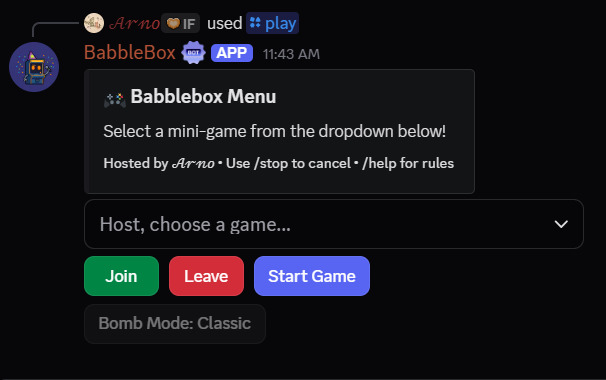
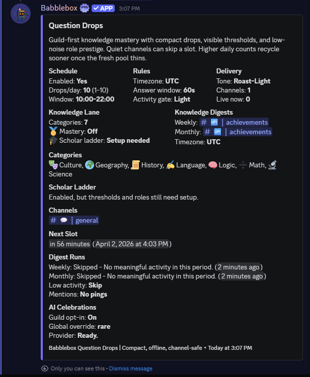
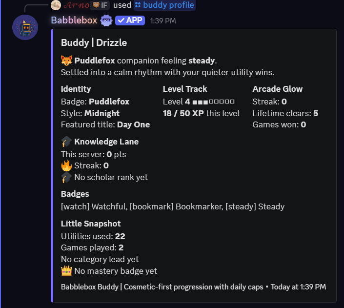
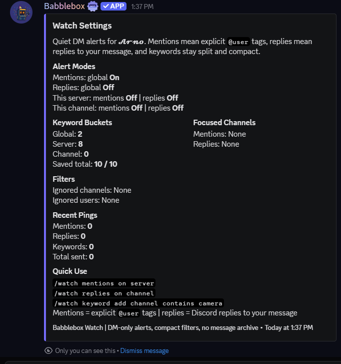
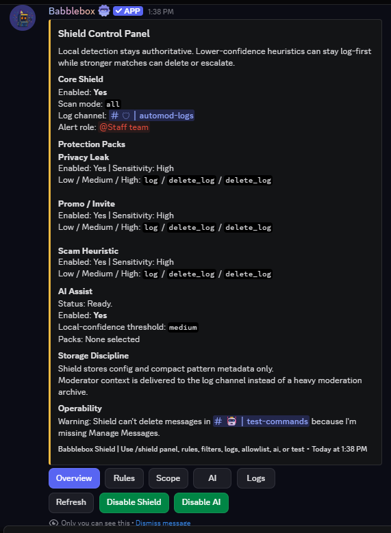

# Babblebox

Babblebox is a modular Discord bot built with Python and `discord.py`.

It is designed around seven clear product lanes:

- Party Games for active voice/text hangouts
- Question Drops for scheduled guild knowledge play and mastery progression
- Anonymous Confessions for staff-blind community submissions
- Everyday Utilities for quiet server life
- Daily Arcade for low-player-count return visits
- Buddy / Profile / Vault for identity, streaks, and showable progress
- Babblebox Shield plus compact admin lifecycle for focused, configurable server safety

Babblebox is intentionally compact:

- no economy grind
- no lootboxes
- no production JSON persistence for durable systems
- no blob/media archives in the database
- no always-on external AI scanning; Shield AI assist is optional and only reviews already-flagged messages

## Official Links

- Official website: [https://arno-create.github.io/babblebox-bot/](https://arno-create.github.io/babblebox-bot/)
- Privacy Policy: [https://arno-create.github.io/babblebox-bot/privacy.html](https://arno-create.github.io/babblebox-bot/privacy.html)
- Terms of Service: [https://arno-create.github.io/babblebox-bot/terms.html](https://arno-create.github.io/babblebox-bot/terms.html)
- Invite link: [https://discord.com/oauth2/authorize?client_id=1480903089518022739](https://discord.com/oauth2/authorize?client_id=1480903089518022739)
- GitHub repository: [https://github.com/arno-create/babblebox-bot](https://github.com/arno-create/babblebox-bot)
- Support server: [https://discord.com/servers/inevitable-friendship-1322933864360050688](https://discord.com/servers/inevitable-friendship-1322933864360050688)

## Premium and Entitlements

Babblebox premium is intentionally narrow:

- free stays genuinely usable and keeps core trust, privacy, and local safety intact
- Patreon is the initial premium source of truth, but entitlements are resolved through a separate provider-agnostic premium layer

### Plan Comparison

- `Free`: the real product lane stays intact, including party games, Daily Arcade, Question Drops, utilities, bounded Shield, and the current free Confessions baseline
- `Supporter`: paid support tier that includes Supporter-tier Inevitable Friendship Discord benefits and keeps Babblebox at Free limits
- `Babblebox Plus`: maps to `IF Epic Patron` and raises personal utility caps for Watch, reminders, and recurring AFK schedules
- `Babblebox Guild Pro`: maps to `IF Legendary Patron`, raises server-side admin caps, unlocks Shield AI's enhanced `gpt-5.4-mini` and `gpt-5.4` tiers, unlocks Question Drops AI celebrations, raises bounded Shield limits, raises bump-detection scale, and raises the safe Confessions image ceiling. Guild Pro unlocks gpt-5.4-mini and gpt-5.4 above the baseline gpt-5.4-nano lane.

### How Premium Activates

1. Use `/premium plans` to compare the real Babblebox tiers first.
2. Use `/premium subscribe` to open Patreon and buy `Supporter`, `Babblebox Plus / IF Epic Patron`, or `Babblebox Guild Pro / IF Legendary Patron`.
3. Buy the tier on Patreon first, then run `/premium link` in Discord to attach that Patreon account to Babblebox.
4. Run `/premium status` to confirm the linked plan and resolved premium state.
5. If you bought Guild Pro, finish with `/premium guild claim` in the server you want to upgrade, then verify it with `/premium guild status`.

### Patreon Tier Mapping

- Patreon now has three combined tiers: `Supporter`, `Babblebox Plus / IF Epic Patron`, and `Babblebox Guild Pro / IF Legendary Patron`
- every paid tier includes both Babblebox and Inevitable Friendship benefits
- if a linked Patreon account still looks free after a recent tier change, run `/premium refresh` or check `/support` before assuming the purchase failed

### Trust and Downgrade Behavior

- Patreon purchases are generally non-refundable except where required by law or Patreon separately approves a refund; see the [Terms of Service](https://arno-create.github.io/babblebox-bot/terms.html)
- hard Patreon auth failures, linked-account identity mismatches, or a local unlink immediately withdraw provider-backed runtime access while still preserving saved feature state
- premium downgrades do not delete saved Watch keywords, reminders, AFK schedules, Shield patterns, or Confessions settings; saved config stays preserved, extra runtime headroom simply pauses, and future expansion stays blocked until you trim it or premium returns
- `/premium unlink` deletes Babblebox's local encrypted Patreon tokens only; it does not pretend to revoke Patreon-side app access for you

## Product Overview

### Party Games

- Broken Telephone
- Exquisite Corpse
- Spyfall
- Word Bomb
- Pattern Hunt
  - one public clue loop with private rule guesses
  - hidden-rule coder DMs and machine-checkable rule families
  - first-round grace, clue budget, and cleaner reveal flow
- Chaos Cards and bomb mode variants
- hybrid slash + `bb!` prefix support
- session stats and session leaderboard commands

### Question Drops

- scheduled in-channel knowledge prompts
- guild-first knowledge lane with `/drops status`, `/drops stats`, and `/drops leaderboard`
- member role controls with `/drops roles status`, `/drops roles remove`, and `/drops roles preference`
- configurable channels, categories, timing, activity gating, and tone
- admin-configurable live-drop role ping with safe mention checks
- category mastery roles
- guild scholar ladder
- custom mastery announcement templates managed inside `/dropsadmin mastery category` and `/dropsadmin mastery scholar`
- profile / buddy / vault knowledge tie-ins
- larger offline content packs with smarter repeat resistance and category shaping
- rare AI celebration copy as an optional Guild Pro layer
- numeric, number-word, safe multiple-choice, one-shot ordered-sequence, and spoiler-aware answer judging

### Everyday Utilities

- Watch V2
  - separate mention alerts
  - separate reply alerts
  - keyword alerts
  - global, server, or channel scope
  - ignored channels
  - ignored users
  - DM-only delivery with cooldowns and dedupe
  - free stays at 10 keywords and 8 filters; Babblebox Plus raises those personal caps
  - Babblebox Plus raises Watch, reminder, and recurring AFK headroom while saved config stays preserved if Plus later expires
- Later
  - one saved reading marker per user per channel
  - media-aware previews
- Capture
  - DM transcript snapshots of recent messages
  - better media placeholders and attachment context
  - private delivery with jump-back context
- Remind
  - safe one-time reminders with small active limits
  - free stays at 3 active reminders with 1 active public reminder; Babblebox Plus raises those personal caps
- Bump Remind
  - Disboard-only V1 with verified provider-success detection
  - one persisted bump cycle per guild and provider
  - restart-safe next-window reminders with bounded retry and dedupe
  - admin setup, status, and preview flow with quiet, public, or off thank-you behavior
  - Babblebox Guild Pro raises the bounded bump-detection channel cap
- AFK
  - immediate, scheduled, or recurring away status
  - timezone-aware `start_at` and recurring local clock scheduling
  - preset reasons with default durations for common routines
  - duration parsing for `30m`, `2h`, `2d`, and compact combos like `1h30m`
  - elapsed and return-time messaging
  - free stays at 6 recurring schedules; Babblebox Plus raises that personal cap

### Anonymous Confessions

- optional feature that only works after admins enable and configure it
- private composer and private member utilities launched with `/confess`, `/confess manage`, `/confess appeal`, `/confess report`, `/confess reply-to-user`, and `/confess about`
- Babblebox keeps the author hidden from members and server staff in normal product use
- staff-blind moderation by confession ID and case ID only while the bot still enforces safety internally
- sensitive confession text, link fields, private media URLs, and owner/accountability linkages are protected with app-level encryption before they reach durable storage
- author linkage and enforcement identity lookups use a separate protected identity domain plus keyed lookup hashes instead of ordinary plaintext user IDs in routine Confessions tables
- duplicate-abuse signals are keyed and guild-scoped so raw database access does not needlessly correlate matching confession text across servers
- Confessions privacy hardening has an operator-facing readiness state; Babblebox warns when legacy rows still need backfill and shows that status in the private Confessions admin dashboard
- up to 4000 characters and one link total per confession, anonymous reply, owner reply, or pending self-edit
- link policy modes are `Disabled`, `Trusted Only` (default), and `Allow All Safe`; Babblebox Shield still blocks malicious, suspicious, adult-blocked, shortener, link-in-bio, storefront, and guild-blocked domains across every mode
- offensive, vulgar, derogatory, spammy, and private-info patterns are filtered before anything posts
- adult / 18+ language is blocked by default unless an admin changes that policy
- shorteners, link-in-bio hubs, storefronts, malicious domains, and adult domains stay blocked even if admins widen the normal Confessions link mode
- admins can role-allowlist or blacklist who may submit; blacklist wins, and a non-empty allowlist means only those roles may submit
- images are off by default and must be explicitly enabled by admins
- free Confessions keeps a sane image ceiling; Babblebox Guild Pro can raise `max_images` to 6 without removing private review, and downgrade keeps the saved higher ceiling while the active current-plan ceiling falls back
- anonymous replies are off by default and must be explicitly enabled by admins
- self-edit is off by default and only applies to still-pending submissions when enabled
- enabled image support stays bounded and always routes through private review, which requires a separate private review channel
- the latest published confession post also keeps a live `Create a confession` launcher so members do not have to return to the panel to submit again
- enabled `Reply anonymously` stays text-only, appears on eligible published confession posts instead of the launch panel, creates one reusable thread per top-level confession when Discord allows it, keeps reply-confessions inside that same thread without nested threads, falls back to ordinary in-channel reply posts when threading is unavailable, and stays anonymous even if private approval happens first
- owner replies are a separate feature, are enabled by default, stay text-only, and publish publicly as `Anonymous Owner Reply` when used
- owner-reply review is off by default; admins can enable it separately if they want owner replies queued before posting
- if someone explicitly replies to your confession or your first public owner reply, Babblebox can DM a bot-private owner reply prompt and `/confess reply-to-user` works as the fallback inbox
- private owner tools let a member delete their own confession or reply without exposing identity
- admins can configure a dedicated appeals / reports channel so members can privately appeal restrictions or report confession problems
- attachment filenames and Discord CDN URLs stay out of staff-visible surfaces
- Babblebox hides the Discord account, but a member-chosen link destination or image itself can still reveal who sent it
- the service still relies on operator trust; privacy hardening reduces casual access and routine DB readability, but it is not a zero-knowledge system
- deploying the Confessions privacy code and keys is not enough by itself; legacy rows remain weaker until the Confessions backfill completes
- Babblebox can automatically suspend or confession-ban internally without exposing the author
- moderation supports approve, deny, delete, pause, restrict-images, clear, and false-positive flows without revealing the author
- terminal confession records scrub body text, previews, links, and attachment metadata while retaining compact keyed duplicate signatures for abuse prevention

### Shield / Safety

- Babblebox Shield
  - Babblebox's bounded cross-feature immunity layer
  - admin-only configuration for administrators or Manage Server users
  - live-message moderation remains optional and admin-configurable
  - first enable applies a recommended non-AI baseline once, while Shield AI stays second-pass only, owner policy controls availability, and Guild Pro only unlocks the higher model tiers
  - always-on private feature-surface checks for Confessions unsafe-link parity, AFK reasons, reminder text plus public reminder delivery, and watch keyword setup
  - AFK reasons and reminders use privacy, adult, and severe checks; watch keyword setup stays privacy-only
  - privacy leak pack
  - promo / invite pack
- first-class `Anti-Spam` pack for explicit message-rate and near-duplicate rules, mention, emoji, invite, and link pressure, bounded corroboration that suppresses healthy fast chat, and configured delete or timeout actions that actually execute
- first-class `GIF Flood / Media Pressure` pack for one-user GIF floods, collective channel GIF pressure, lightweight meaningful-text weighting, repeated GIF reuse, grouped incident dedupe, and safer mixed chat
- scam / malicious-link pack with local weighted scam-language scoring plus no-link DM-lure detection for money, wins, picks, and related payout bait routed into DMs or private follow-up
- hard local trusted-brand impersonation blocking for spoofed or lookalike safe domains
- `Adult Links + Solicitation` pack for adult-domain intel plus optional solicitation / DM-ad text detection
- `Severe Harm / Hate` pack for sexual-exploitation solicitation, explicit self-harm encouragement, eliminationist or dehumanizing hate, severe slur abuse, and reference-aware quote/report/moderation suppressors
- optional Shield link policy mode: `Default` or `Trusted Links Only`, separate from Confessions link mode
- panel-first `/shield panel` editing with pack-aware `Actions`, `Options`, and `Exemptions` lanes so spam-only or GIF-only controls do not spill into unrelated packs, while each pack can inherit the global timeout or keep a dedicated timeout profile
- built-in trusted families and direct domains are visible under `/shield trusted`, with bounded per-server disable or re-enable controls
- bundled local link safety with safe-domain families, suspicious-domain gating, and no external provider requirement
- local-first malicious-link blocking with a feed of ~200k known malicious domains
- in-scope Shield coverage for new messages, meaningful edits, and webhook/community-post style delivery
- bot and webhook scam handling stays conservative by default unless the evidence is clearly dangerous
- optional AI-assisted second-pass review for moderator context only
- Shield AI stays live-message-only; AFK, reminders, watch keywords, and Confessions feature checks remain local-first and AI-free
- Shield AI can route between `gpt-5.4-nano`, `gpt-5.4-mini`, and `gpt-5.4`; `gpt-5.4-nano` is the baseline tier, and Guild Pro unlocks `gpt-5.4-mini` and `gpt-5.4` above the baseline `gpt-5.4-nano` lane while diagnostics report the effective lane plus local readiness and entitlement state
- ordinary guild AI needs both owner policy and Babblebox Guild Pro
- `/shield ai` only configures review scope; Guild Pro plus owner policy controls real AI access and allowed models
- log-first defaults with global `adaptive` vs `compact` delivery, `smart` vs `never` ping policy, and bounded per-pack delivery overrides
  - trusted-role bypass
  - included / excluded scope controls
- bounded allowlists for domains, invite codes, and phrases
  - compact advanced patterns with `contains`, `word`, and safe `wildcard` matching
  - raw custom regex intentionally unsupported to avoid unsafe hot-path backtracking
- Admin lifecycle helpers
  - direct emergency channel lock lane with `/lock channel` and `/lock remove`
  - configurable default lock notice plus an admin-only access option for the `/lock` lane
  - bounded overwrite restore that only reverts the `@everyone` flags Babblebox changed and intentionally refuses category-synced direct locks
  - returned-after-ban follow-up role assignment within a clear 30-day return window
  - auto-remove or moderator-review follow-up role expiry
- review alerts with compact action buttons instead of a case system
- shared exclusions, trusted-role bypasses, permission diagnostics, and compact admin logs

### Daily Arcade

Babblebox Daily is now a small arcade instead of one booth.

Current daily modes:

- Shuffle Booth
  - stronger word shapes, longer answers, and cleaner morphology variety
- Emoji Booth
  - layered clue trails that stay readable in Discord
- Signal Booth
  - compact decode variants across Caesar shift, mirror alphabet, and adjacent-pair swap

Daily Arcade design rules:

- deterministic generation from the UTC date
- three booths are selected together so same-day answers stay unique
- internal `standard` / `smart` / `hard` profiles shift booth difficulty without fragmenting the shared daily
- open and result cards show Difficulty, Length, and Profile while public failed answers stay spoiler-safe
- one compact result row per `user + date + mode`
- small attempt limits
- shareable output
- no external content APIs
- raw rows pruned after 180 days
- streaks and lifetime totals stay in the profile row

### Buddy / Profile / Vault

- one lightweight Buddy per user
- cosmetic style + nickname + mood + title + featured badge
- XP and level progression tied to actual use
- anti-farm per-day XP caps by category
- `/profile` is public-friendly by default
- `/vault` stays the more personal snapshot
- Question Drops totals, mastery flavor, and scholar ranks fold in without replacing Daily or party-game identity

## Commands

Slash commands and the `bb!` prefix both work.

### Core

| Slash | Prefix | Purpose |
| --- | --- | --- |
| `/help` | `bb!help` | Open the in-bot manual |
| `/support` | `bb!support` | Open support links, bug-report info, and official resources |
| `/confess` | n/a | Open the anonymous confession composer |
| `/ping` | `bb!ping` | Health check |
| `/play` | `bb!play` | Open a game lobby |
| `/stop` | `bb!stop` | Force stop the active lobby/game |
| `/vote` | `bb!vote` | Trigger a Spyfall vote |
| `/stats` | `bb!stats` | Session stats |
| `/leaderboard` | `bb!leaderboard` | Session leaderboard |
| `/chaoscard` | `bb!chaoscard` | Cycle or inspect the lobby Chaos Card |

### Party Games

Party game flow still starts from `/play`.

- Broken Telephone: 3+ players
- Exquisite Corpse: 3+ players
- Spyfall: 3+ players
- Word Bomb: 2+ players
- Pattern Hunt: 3+ players, public clue loop, private rule guesses, and coder role DMs that stay hidden from the room

Babblebox now nudges solo users toward Daily Arcade, Buddy, Profile, and utilities instead of leaving them at dead ends.

Related party-game commands:

Use slash for multi-family Pattern Hunt guesses. Prefix stays positional, so the example below keeps it to one clean family.

| Slash | Prefix | Purpose |
| --- | --- | --- |
| `/hunt` | `bb!hunt` | Open the private Pattern Hunt card |
| `/hunt status` | `bb!hunt status` | Mirror the live Pattern Hunt state card privately |
| `/hunt guess` | `bb!hunt guess contains_digits` | Submit a private 1-3 family rule theory |

### Question Drops

Slash is recommended for multi-option setup here. Prefix stays positional, so the examples below keep to the shortest truthful forms.

| Slash | Prefix | Purpose |
| --- | --- | --- |
| `/drops status` | `bb!drops status` | View schedule, channels, categories, and operability |
| `/dropsadmin config` | `bb!drops config true 4` | Configure cadence, timing, tone, difficulty profile, and AI opt-in |
| `/dropsadmin channels` | `bb!drops channels add #trivia` | Add or remove Question Drops channels |
| `/dropsadmin categories` | `bb!drops categories disable math` | Enable, disable, or reset knowledge categories |
| `/dropsadmin ping` | `bb!drops ping set @Role` | View, set, or clear the optional live-drop ping role |
| `/drops stats` | `bb!drops stats @name` | View guild-first Question Drops progress |
| `/drops leaderboard` | `bb!drops leaderboard science` | View the guild knowledge board |
| `/drops roles status` | `bb!drops roles status` | View your current Babblebox-managed Question Drops roles and future-grant state |
| `/drops roles remove` | `bb!drops roles remove @Role` | Remove one current Babblebox-managed role or all current Babblebox Question Drops roles |
| `/drops roles preference` | `bb!drops roles preference stop true` | Stop future Babblebox role grants or receive them again with optional restore |
| `/dropsadmin mastery category` | `bb!drops mastery category science true 1 @Role 25` | Configure category mastery roles, or manage default and per-tier announcement templates with `template_action` |
| `/dropsadmin mastery scholar` | `bb!drops mastery scholar true 1 @Role 100` | Configure the guild scholar ladder, or manage default and per-tier announcement templates with `template_action` |
| `/dropsadmin mastery recalc` | `bb!drops mastery recalc` | Preview or execute a grant-only role recalculation |

Question Drops notes:

- 1-10 drops per day
- `/dropsadmin config` now carries a compact difficulty profile: Standard stays welcoming, Smart leans medium and hard, Hard is noticeably tougher without changing point values
- live drops stay compact and block `/play` only in the same channel while unresolved
- `/dropsadmin ping` configures one optional role mention for live drops; Babblebox skips the ping automatically when the role is missing, unmentionable, or unsafe in that channel
- numeric answers accept clean digits, and simple number words only for whole-number prompts
- smarter concept, family, tag, and answer-shape rotation now keep higher-volume lanes from turning into a trivial farm
- Question Drops AI celebrations require Guild Pro, while the offline content expansion and smarter rotation stay part of the core lane
- removing current Babblebox roles does not erase earned mastery history, and opt-out is the durable "do not re-grant" switch
- mastery announcements can use Babblebox's default copy, a scope default template, or a tier override with fallback order: tier override -> scope default -> Babblebox default
- category template tokens: `{user.mention}` `{user.name}` `{user.display_name}` `{role.name}` `{tier.label}` `{threshold}` `{category.name}`
- scholar template tokens: `{user.mention}` `{user.name}` `{user.display_name}` `{role.name}` `{tier.label}` `{threshold}`
- category mastery and scholar ladder stay guild-first
- profile, buddy, and vault surfaces fold the knowledge lane in without confusing it with Daily Arcade

### Everyday Utilities

| Slash | Prefix | Purpose |
| --- | --- | --- |
| `/watch mentions` | `bb!watch mentions` | Toggle mention alerts by channel, server, or global scope |
| `/watch replies` | `bb!watch replies` | Toggle reply alerts separately from mentions |
| `/watch keyword add` | `bb!watch keyword add channel contains camera` | Add a watched keyword in channel/server/global scope |
| `/watch keyword remove` | `bb!watch keyword remove server camera` | Remove a watched keyword |
| `/watch ignore channel` | `bb!watch ignore channel` | Exclude the current channel from Watch |
| `/watch ignore user` | `bb!watch ignore user @name` | Ignore one user's messages in Watch |
| `/watch list` | `bb!watch list` | See keyword buckets and focused channels |
| `/watch settings` | `bb!watch settings` | See mention/reply states, ignore lists, and recent counts |
| `/watch off` | `bb!watch off server` | Clear watch settings by scope |
| `/later mark` | `bb!later mark` | Save your current reading spot |
| `/later list` | `bb!later list` | List saved markers |
| `/later clear` | `bb!later clear here` | Clear markers |
| `/capture` | `bb!capture 10` | DM yourself a recent-message snapshot |
| `/remind set` | `bb!remind set 2h dm take a break` | Create a reminder |
| `/remind list` | `bb!remind list` | Review active reminders |
| `/remind cancel` | `bb!remind cancel <id>` | Cancel a reminder |
| `/bremind setup` | `bb!bremind setup` | Configure verified Disboard bump reminders |
| `/bremind status` | `bb!bremind status` | See the next due window, last bump, and delivery blockers |
| `/bremind test` | `bb!bremind test both` | Preview reminder and thank-you copy without starting a timer |
| `/bremind detect add` | `bb!bremind detect add #partnerships` | Add a verified bump-detection channel |
| `/bremind destination` | `bb!bremind destination #reminders @BumpPing` | Set reminder delivery channel and optional role ping |
| `/afk` | `bb!afk` | Set, schedule, or clear AFK |
| `/afkstatus` | `bb!afkstatus` | View AFK status |
| `/afktimezone set` | `bb!afktimezone set UTC+04:00` | Save your AFK timezone |
| `/afktimezone view` | `bb!afktimezone view` | View your AFK timezone |
| `/afkschedule add` | `bb!afkschedule add daily 23:30` | Create a recurring AFK schedule |
| `/afkschedule list` | `bb!afkschedule list` | Review recurring AFK schedules |
| `/afkschedule remove` | `bb!afkschedule remove <id>` | Remove a recurring AFK schedule |

### Premium

| Slash | Prefix | Purpose |
| --- | --- | --- |
| `/premium status` | n/a | See linked Patreon state, active plans, resolved limits, claim availability, and the next step |
| `/premium plans` | n/a | Compare `Supporter`, `Babblebox Plus`, and `Babblebox Guild Pro`, plus the honest Free baseline |
| `/premium subscribe` | n/a | Open the official Patreon page and follow the buy-then-link onboarding path |
| `/premium link` | n/a | Start Patreon account linking privately with the same account that owns the Babblebox tier |
| `/premium refresh` | n/a | Recheck Patreon-backed entitlements and stale or mismatched state |
| `/premium unlink` | n/a | Remove the current premium account link, delete Babblebox's local encrypted Patreon tokens, and keep saved config preserved |
| `/premium guild status` | n/a | See the current guild entitlement, claim state, and what Guild Pro changes on this server |
| `/premium guild claim` | n/a | Claim a Guild Pro entitlement for the current server explicitly |
| `/premium guild release` | n/a | Release the current guild claim without deleting saved server configuration |

Buy the tier on Patreon first, then run `/premium link` in Discord to attach that Patreon account to Babblebox. Patreon now uses three combined tiers: `Supporter`, `Babblebox Plus / IF Epic Patron`, and `Babblebox Guild Pro / IF Legendary Patron`.

If a Guild Pro claim source expires but the same owner still has another valid Guild Pro source, Babblebox can rebind that server claim without moving it to another user or deleting saved server configuration.

AFK examples:

- `/afk focus 30m`
- `/afk preset:sleeping`
- `/afk start_at:23:00 preset:sleeping`
- `/afktimezone set America/New_York`
- `/afkschedule add repeat:weekdays at:18:00 preset:studying`
- `bb!afk deep work 1h30m`

`/bremind` is the separate admin utility lane for server-list bump reminders. V1 is intentionally Disboard-only, starts the cooldown only from verified provider output in configured channels, keeps one persisted cycle per guild/provider, exposes `/bremind status` plus `/bremind test`, and supports `quiet`, `public`, or `off` thank-you behavior without fake manual timers.

Shield now backs the bounded safety lane for stored or fan-out utility text as well: AFK reasons plus reminder text and public reminder delivery keep their feature-local validation first, then run through private Shield privacy, adult, and severe checks. Watch keywords stay narrower and use only the privacy feature lane.

Utility premium notes:

- free remains useful: Watch keeps 10 keywords and 8 filters, reminders keep 3 active and 1 public, AFK keeps 6 recurring schedules, and bump reminders keep 5 detection channels
- Babblebox Plus raises the personal Watch, reminder, and AFK caps
- Babblebox Guild Pro raises the bump-detection channel cap
- downgrade never deletes saved utility state; over-limit reminders, Watch filters, keywords, AFK schedules, and bump channels stay saved, but only the current-plan subset remains active until the saved state is reduced or premium returns

### Shield / Safety

Shield commands are private/admin-facing by default. The streamlined slash surface is centered on `/shield panel`.
Use `/shield panel` first: pick a pack, then Babblebox splits editing into `Actions`, `Options`, and `Exemptions` so only the relevant controls show up.
Slash is the best fit for multi-option admin setup here. Prefix stays positional, so the examples below stay intentionally short.

| Slash | Prefix | Purpose |
| --- | --- | --- |
| `/shield panel` | `bb!shield panel` | Open the panel-first Shield editor for rules, scope, links, AI, logs, and trust state |
| `/shield module` | `bb!shield module true` | Turn live Shield moderation on or off without opening the panel |
| `/shield escalation` | `bb!shield escalation 3 10 15` | Configure repeated-hit escalation and the global Shield timeout fallback |
| `/shield rules` | `bb!shield rules promo true log` | Use the precise slash fallback for one pack's actions, relevant thresholds, or that pack's dedicated timeout override |
| `/shield links` | `bb!shield links trusted_only` | Configure Shield `Default` vs `Trusted Links Only` live-message policy, action ladder, and the trusted-link timeout profile |
| `/shield trusted` | `bb!shield trusted view` | Inspect Shield's built-in trusted families/domains and local trust overrides |
| `/shield logs` | `bb!shield logs #shield-log @Mods compact never` | Set the mod-log channel and alert role, then tune global compact/no-ping delivery or a pack override |
| `/shield filters` | `bb!shield filters` | Tune global scope, includes, excludes, trusted roles, and solicitation carve-out channels |
| `/shield exemptions` | `bb!shield exemptions` | Use the quick slash fallback for one pack-local member, role, or channel exemption without weakening the rest |
| `/shield allowlist` | `bb!shield allowlist` | Manage domain, invite, and phrase allowlists |
| `/shield severe category` | `bb!shield severe category self_harm_encouragement off` | Turn severe-harm categories on or off |
| `/shield severe term` | `bb!shield severe term add you scumlord` | Add, disable, restore, or remove bounded severe terms |
| `/shield ai` | `bb!shield ai high true false true true true` | Configure Shield AI review scope for already-flagged live messages |
| `/shield advanced add` | `bb!shield advanced add Gift claim*gift wildcard log` | Add a safe advanced pattern |
| `/shield advanced list` | `bb!shield advanced list` | Review advanced patterns |
| `/shield test` | `bb!shield test free nitro claim now https://bit.ly/x` | Dry-run a message through Shield |

Shield's live-message link policy is intentionally separate from Confessions link mode. Confessions keeps `Disabled`, `Trusted Only`, and `Allow All Safe`, while Shield keeps `Default` plus the bounded `Trusted Links Only` mode. That stricter Shield mode allows the built-in trusted pack plus admin allowlisted domains and invite codes as policy exceptions, and `/shield trusted` now exposes the built-in families, direct domains, and any local built-in disables that affect trusted-only mode. Malicious, trusted-brand impersonation, adult-domain, and strong suspicious-link intel still wins over those trust exceptions. Shield phrase allowlists stay narrower: they suppress only targeted promo or adult-solicitation text matches. The live Shield packs are `Privacy Leak`, `Promo / Invite`, `Anti-Spam`, `GIF Flood / Media Pressure`, `Scam / Malicious Links`, `Adult Links + Solicitation`, and `Severe Harm / Hate`; no-link DM-lure bait lives under the scam pack and now covers money, wins, picks, and similar private-route payout lures, Anti-Spam stays grounded in explicit rate and duplicate rules with bounded corroboration, the GIF lane now splits one-user floods from collective channel pressure so collective cleanup can remove the exact live GIF streak for streak floods or only the newest contributing GIF posts from the active pressure slice for channel-pressure matches while personal abuse can still enforce one member, never text, the channel lane can trigger on either a true consecutive GIF streak or effective GIF pressure after lightweight meaningful-text weighting, collective pressure never adds strikes or timeouts on its own, tighter low-end GIF options exist for stricter rooms, optional emote and capitals lanes stay off until an admin enables them, moderators are exempt from Anti-Spam by default unless admins choose a stricter policy, `/shield panel` now keeps pack-local `Actions`, `Options`, and `Exemptions` together without mixing unrelated controls, `/shield module` owns the live on/off switch, `/shield escalation` owns repeated-hit escalation plus the global timeout fallback, `/shield logs` now carries global compact/no-ping defaults plus bounded per-pack overrides, each pack can inherit the global timeout or keep a dedicated timeout override, the trusted-link lane can do the same, live moderation stays opt-in, the first enable applies a recommended non-AI baseline, and Shield AI remains second-pass review only while Guild Pro unlocks `gpt-5.4-mini` plus `gpt-5.4`.

Shield also now governs eligible non-chat surfaces in a bounded way. Confessions keeps its own privacy, review, and workflow logic, but shares Shield link intelligence. AFK reasons plus reminder text and public reminder delivery use fixed private privacy, adult, and severe feature-surface policies. Watch keyword setup stays privacy-only. None of those private feature checks create mod-log spam or call Shield AI.

### Emergency Locks

`/lock` is Babblebox's direct moderator/admin command lane. Moderators who can manage channels or messages, timeout, kick, or ban members, plus admins can use it by default, and admins can switch the lane to admins-only when they want tighter control.
Direct locks only target normal text channels. Babblebox intentionally refuses category-synced channels, only changes the bounded `@everyone` send/thread/reaction flags it owns, and only restores those same flags later. If a channel already fully denies those flags, Babblebox can track the existing lock without changing the overwrite and later clears only its own timer or marker. Timed locks persist through restart reconciliation.

| Slash | Prefix | Purpose |
| --- | --- | --- |
| `/lock channel` | `bb!lock channel #ops 30m` | Safely lock one normal text channel, optionally with a timer |
| `/lock remove` | `bb!lock remove #ops` | Safely remove one Babblebox-tracked emergency lock |
| `/lock settings` | `bb!lock settings` | Review or configure the default lock notice and access model |
| `/timeout remove` | `bb!timeout remove @member Appeal accepted` | Safely remove one active member timeout |

The default lock notice is configurable, one-off notice overrides stay optional per lock, notice posting can be suppressed per run, and every lock or unlock is logged cleanly to the shared admin log lane when one is configured. `/timeout remove` uses the same compact admin log lane when one is configured and checks moderator access, hierarchy, bot timeout permission, bot hierarchy, and whether the member is actually timed out before clearing anything.

### Admin Lifecycle

Admin lifecycle commands stay private/admin-facing. `/admin panel` is now the interactive admin control surface: its overview quick-config row jumps straight into follow-up, exclusions, and logs, section buttons open focused editors for follow-up, exclusions, and logs directly from the UI, and `/admin permissions` stays the truthful diagnostics lane when something feels blocked.
Slash is recommended for the heavier config flows here. Prefix stays positional, so the examples below show the safest compact forms.

| Slash | Prefix | Purpose |
| --- | --- | --- |
| `/admin panel` | `bb!admin panel` | Open the interactive admin lifecycle control surface |
| `/admin status` | `bb!admin status` | View overview counts or inspect one member |
| `/admin followup` | `bb!admin followup true @Probation review 30d` | Configure returned-after-ban follow-up roles |
| `/admin logs` | `bb!admin logs #admin-log @Mods` | Set the shared admin log channel and alert role |
| `/admin exclusions` | `bb!admin exclusions` | Configure shared exclusions and trusted roles |
| `/admin permissions` | `bb!admin permissions` | Diagnose missing bot permissions and the affected feature lanes |

The admin surface is intentionally narrow: follow-up stays batch-first and review-lane focused, routine sweeps emit grouped summaries, review mode uses one persistent shared queue message, and the panel remains the premium path for common changes while commands stay precise fallbacks. The whole lane now stays limited to follow-up, exclusions, logs, permission diagnostics, direct locks, and timeout removal.

### Daily Arcade

| Slash | Prefix | Purpose |
| --- | --- | --- |
| `/daily` | `bb!daily` | Open today's public-friendly arcade overview |
| `/daily play <guess>` | `bb!daily play <guess>` | Open or play the default Shuffle Booth |
| `/daily play emoji <guess>` | `bb!daily play emoji <guess>` | Play Emoji Booth |
| `/daily play signal <guess>` | `bb!daily play signal <guess>` | Play Signal Booth |
| `/daily stats` | `bb!daily stats` | View compact arcade streaks and recent runs |
| `/daily share` | `bb!daily share` | Share a completed booth result |
| `/daily leaderboard` | `bb!daily leaderboard` | View arcade standings |

Daily visibility notes:

- `/daily`, `/daily play`, and `/daily stats` now default to public showable cards
- choose `visibility: private` whenever you want the old only-you flow
- cooldowns only apply to real public cards; storage errors, validation issues, state mismatches, and cooldown warnings stay private
- Shuffle leans on stronger letter shapes, Emoji on layered clueing, and Signal on named codec variants so the booths feel distinct
- cards show Difficulty, Length, and Profile on open and result views without leaking failed public answers
- public Daily cards stay spoiler-safe and do not reveal failed answers in-channel

### Buddy / Profile / Vault

| Slash | Prefix | Purpose |
| --- | --- | --- |
| `/buddy` | `bb!buddy` | Open your Buddy card |
| `/buddy profile` | `bb!buddy profile` | Re-open the Buddy card explicitly |
| `/buddy rename` | `bb!buddy rename Pebble` | Rename your Buddy |
| `/buddy style` | `bb!buddy style sunset` | Change Buddy style |
| `/buddy stats` | `bb!buddy stats` | View Buddy progression |
| `/profile` | `bb!profile` | View a public-friendly profile card |
| `/vault` | `bb!vault` | Open your more personal vault view |

### Anonymous Confessions

| Slash | Prefix | Purpose |
| --- | --- | --- |
| `/confess` | n/a | Open the private confession composer |
| `/confess manage` | n/a | Open the private manage-my-confession flow |
| `/confess appeal` | n/a | Open the private anonymous appeal flow |
| `/confess report` | n/a | Open the private anonymous report flow |
| `/confess reply-to-user` | n/a | Review member responses to your confession and post an anonymous owner reply |
| `/confess about` | n/a | Show the private How It Works explanation |
| `/confessions` | `bb!confessions` | Open the admin control panel for setup, review, and status |
| `/confessions role` | `bb!confessions role` | View or change Confessions role allowlist / blacklist state |
| `/confessions moderate` | `bb!confessions moderate` | Approve, deny, delete, pause, restrict images, ban, clear, or mark a confession false positive by confession ID or case ID |

Confession notes:

- Confessions are optional and stay unavailable until admins enable and configure them
- staff see confession IDs and case IDs, never the author
- Babblebox still enforces safety internally and can automatically restrict repeat abuse without exposing identity
- Confessions storage protects sensitive submission content, private media URLs, and author linkage with app-level encryption plus separate identity lookup hashes
- startup and admin status surfaces now warn if Confessions privacy hardening is only partially migrated and the backfill still needs to run
- duplicate-abuse signals are keyed and guild-scoped rather than global across every server
- adult / 18+ language is blocked by default unless admins change that policy
- Confessions allow up to 4000 characters plus one link total under the server's active link mode
- link modes are `Disabled`, `Trusted Only` (default), and `Allow All Safe`; Shield still blocks unsafe and high-risk destinations in every mode
- `/confess manage`, `/confess appeal`, `/confess report`, and `/confess about` mirror the private member flows from the panel buttons
- admins can use `/confessions role` to manage role allowlist / blacklist controls; blacklist wins, and a non-empty allowlist means only those roles may submit
- images are off by default and only work after admins explicitly enable them
- anonymous replies are off by default and only work after admins explicitly enable them
- self-edit is off by default and only applies to pending submissions when enabled
- enabled image confessions always enter the private review queue and require a separate private review channel
- the latest eligible live confession post also shows `Create a confession` so members always have one current public launcher in-channel
- enabled `Reply anonymously` stays text-only, launches from eligible published confession posts instead of the public panel, uses one reusable thread per top-level confession when Discord allows it, keeps reply-confessions inside that same thread without nested threads, and stays anonymous even if private approval happens first
- owner replies are separate from public anonymous replies, are enabled by default, stay text-only, and post publicly as `Anonymous Owner Reply`
- owner replies only come from Babblebox-owned reply opportunities after someone explicitly replies to your confession or your first owner reply; the chain stops after that extra bounce
- members can privately delete their own confessions and use a dedicated appeals / reports channel when admins configure one
- Babblebox hides the sender's account identity, but a personal link or identifiable image can still reveal them if they include it
- the service operator is still part of the trust model; the privacy upgrade is meant to reduce casual access, not to claim impossible operator access
- attachment filenames and raw Discord attachment URLs are kept out of staff-visible embeds
- `/confessions moderate` supports ID-based moderation plus restrict-images, clear, and false-positive override paths

## Watch V2 Notes

Watch now distinguishes three alert types:

- mentions
- replies
- keywords

Important rules:

- replies only trigger when someone replies to a message owned by the watched user
- bots, webhooks, and self-messages are ignored
- delivery stays DM-only
- dedupe and cooldown protection stay in place
- no message-content archive is stored
- recent counts in settings are runtime-only, not a long-term inbox table

## Visibility Defaults

Babblebox now treats visibility more intentionally:

- public by default for `/help`, `/profile`, `/buddy`, `/daily`, `/daily play`, `/daily stats`, `/daily share`, and `/daily leaderboard`
- public-friendly card outputs keep light user/channel cooldowns to avoid spam
- private by default for Watch setup, reminders, Later, Capture, Shield config, and other sensitive utilities
- if a command exposes a `visibility` option, public mode now routes through a real visible channel response instead of silently collapsing to only-you

## Shield Notes

Babblebox Shield is intentionally compact and conservative:

- off until an admin enables it
- no deleted-message archive table
- no full message-body retention in Postgres
- moderator context goes to a configured log channel instead of a heavy database log
- low-confidence repeated-link notes stay compact, no-ping, and cohort-deduped instead of repeatedly blasting the mod log
- compact anti-spam uses short-lived per-user windows for duplicate spam, message-rate bursts, and link or invite floods, while the GIF lane keeps short-lived per-user grouping, a true live channel streak, a bounded recent pressure slice with lightweight meaningful-text weighting, and soft channel-only suppression instead of a moderation archive
- Shield log delivery can stay `adaptive` or force `compact`, and alert-role pings can stay `smart` or `never`, with per-pack overrides where calmer delivery matters
- repeated-hit escalation is in-memory and bounded
- custom regex is intentionally not accepted; advanced mode uses safe text matching only
- in-scope scans can cover new posts, meaningful edits, embed text, attachment labels, forwarded message snapshots, and webhook/community-post style delivery
- attachment filenames stay metadata-only for link repetition; real link evidence must come from actual extracted links, not repeated media filenames
- solicitation carve-out channels only relax the optional solicitation / DM-ad text detector; adult-domain, scam, and malicious-link protections still run there
- local scam decisions combine host/path/query risk with brand bait, official-looking framing, CTA wording, urgency, newcomer first-link context, fresh-campaign reuse, and explicit warning/education suppressors
- optional AI review never becomes the primary moderation engine
- AI review only runs after local Shield already flagged a message
- Shield AI defaults to the routed `gpt-5.4-nano` tier when owner policy enables it; Guild Pro unlocks `gpt-5.4-mini` and `gpt-5.4`
- AI review is admin-visible, tiered by model rather than support-server carveout, and never punishes by itself
- AI review can cover privacy, promo, scam, adult, and severe once admins opt those packs in
- only minimal, sanitized, truncated flagged text from the scanned surfaces is sent to the AI provider

## Capture and Later Media Handling

Capture and Later now treat attachment-only messages more cleanly.

Examples:

- `[image: cat.png]`
- `[video: clip.mp4]`
- `[attachment: notes.pdf]`
- `[media: 2 images, 1 file]`

Important rules:

- no media blobs are stored in Postgres
- Later markers keep compact attachment labels instead of raw attachment URLs
- private Capture transcript files may include currently available attachment URLs at send time, but are not archived long-term

## Daily Arcade Storage Discipline

Babblebox is designed for a small free-tier Postgres budget.

### Persistent identity row

- `bb_user_profiles`
  - one row per user
  - buddy identity
  - XP
  - streaks
  - aggregate counters

### Daily raw rows

- `bb_daily_results`
  - one row per `user + date + mode`
  - attempts
  - solved flag
  - timestamps
  - solve time

Retention:

- raw Daily Arcade rows prune after 180 days
- streaks and lifetime totals remain in `bb_user_profiles`

### Utility persistence

Utility persistence remains Postgres-first:

- `utility_watch_configs`
- `utility_watch_keywords`
- `utility_later_markers`
- `utility_reminders`
- `utility_afk`
- premium entitlement state stays in separate premium tables rather than being mixed into utility persistence

New Watch V2 storage stays compact:

- booleans for global mention/reply alerts
- small JSON arrays for guild/channel filters
- small JSON arrays for ignored channels/users
- compact keyword rows with optional guild/channel scope

### Shield persistence

Shield stays config-only and compact:

- `shield_guild_configs`
- `shield_custom_patterns`

Stored data is intentionally small:

- module and pack enabled flags
- action modes and sensitivities
- AI confidence threshold and AI-eligible pack choices
- compact include / exclude / trusted lists
- compact bounded allowlists
- escalation thresholds
- safe advanced pattern metadata
- the `Anti-Spam` and `GIF Flood / Media Pressure` pack config only; short-lived spam and GIF windows stay in memory

Not stored:

- full moderation event logs
- deleted-message bodies
- raw AI-submitted message bodies in Shield persistence
- attachment blobs
- large strike archives

### Admin lifecycle persistence

Admin lifecycle storage stays row-based and compact:

- `admin_guild_configs`
- `admin_ban_return_candidates`
- `admin_followup_roles`

Stored data is intentionally small:

- one shared config row per guild
- short-lived ban-return candidates with a 30-day purge window
- active follow-up role rows only while Babblebox still manages that follow-up

Not stored:

- Babblebox ban / kick / timeout case history
- full join / leave archives
- per-member scheduler tasks
- long-term punishment event logs
- message transcripts or DM bodies

## Architecture

```text
.
|-- babblebox/
|   |-- __init__.py
|   |-- admin_service.py
|   |-- admin_store.py
|   |-- bot.py
|   |-- command_utils.py
|   |-- daily_challenges.py
|   |-- game_engine.py
|   |-- pattern_hunt_game.py
|   |-- premium_crypto.py
|   |-- premium_limits.py
|   |-- premium_models.py
|   |-- premium_provider.py
|   |-- premium_provider_patreon.py
|   |-- premium_service.py
|   |-- premium_store.py
|   |-- profile_service.py
|   |-- profile_store.py
|   |-- question_drops_ai.py
|   |-- question_drops_content.py
|   |-- question_drops_service.py
|   |-- question_drops_store.py
|   |-- question_drops_style.py
|   |-- shield_ai.py
|   |-- shield_service.py
|   |-- shield_store.py
|   |-- text_safety.py
|   |-- utility_helpers.py
|   |-- utility_service.py
|   |-- utility_store.py
|   |-- web.py
|   `-- cogs/
|       |-- __init__.py
|       |-- afk.py
|       |-- admin.py
|       |-- events.py
|       |-- gameplay.py
|       |-- identity.py
|       |-- meta.py
|       |-- party_games.py
|       |-- premium.py
|       |-- question_drops.py
|       |-- shield.py
|       `-- utilities.py
|-- assets/
|-- tests/
|-- index.html
|-- main.py
`-- requirements.txt
```

### Important modules

- `babblebox/bot.py`: bot bootstrap, extension loading, dictionary setup, sync
- `babblebox/game_engine.py`: lobby state, gameplay flow, recaps, help/manual, session stats
- `babblebox/pattern_hunt_game.py`: Pattern Hunt hidden-rule engine, DM onboarding, and anchor flow
- `babblebox/premium_store.py`: separate premium entitlement persistence, claim state, OAuth sessions, webhook dedupe, and audit records
- `babblebox/premium_service.py`: plan resolution, entitlement snapshots, Patreon linking, guild claims, and downgrade-safe enforcement helpers
- `babblebox/premium_provider_patreon.py`: Patreon OAuth, membership normalization, and webhook verification adapter
- `babblebox/utility_store.py`: Postgres-first utility persistence, including Watch V2 and bump reminder state
- `babblebox/utility_service.py`: Watch, Later, Capture, Remind, verified bump reminders, and AFK orchestration
- `babblebox/utility_helpers.py`: utility preview rendering, transcript formatting, and utility delivery helpers
- `babblebox/daily_challenges.py`: deterministic Daily Arcade booth generation
- `babblebox/profile_store.py`: compact profile and daily persistence
- `babblebox/profile_service.py`: Daily Arcade, Question Drops identity tie-ins, Buddy, Profile, Vault, and anti-farm progression
- `babblebox/question_drops_content.py`: Question Drops seed content and generated variants
- `babblebox/question_drops_service.py`: Question Drops scheduling, judging, mastery, and guild-first panels
- `babblebox/question_drops_store.py`: Question Drops persistence and config normalization
- `babblebox/question_drops_style.py`: Question Drops emoji and presentation helpers
- `babblebox/admin_store.py`: compact admin lifecycle config and pending-state persistence
- `babblebox/admin_service.py`: returned-after-ban follow-up logic, locks, timeout removal, and bounded sweeping
- `babblebox/shield_ai.py`: optional AI provider integration, redaction, truncation, and safe parsing
- `babblebox/shield_store.py`: compact Shield config persistence
- `babblebox/shield_service.py`: Shield matching, cache rebuilds, actions, and mod-log delivery
- `babblebox/cogs/admin.py`: admin-facing lifecycle panel, grouped commands, and review buttons
- `babblebox/cogs/identity.py`: Daily Arcade, Buddy, Profile, and Vault commands
- `babblebox/cogs/meta.py`: in-bot manual and compact help surfaces
- `babblebox/cogs/party_games.py`: Pattern Hunt private command surface
- `babblebox/cogs/premium.py`: premium status, linking, refresh, and guild-claim commands
- `babblebox/cogs/question_drops.py`: Question Drops grouped command surface and mastery admin flows
- `babblebox/cogs/shield.py`: admin-facing Shield command surface
- `babblebox/cogs/utilities.py`: Watch V2, Later, Capture, Remind, AFK, and Bump Remind commands

## Hosting Notes

Babblebox is designed for constrained hosting:

- no giant analytics tables
- no media/blob storage
- no giant inventory or economy loops
- no external Daily APIs
- small connection pools
- limited background scheduling
- deterministic Daily generation from local data

## Setup

### Requirements

- Python 3.11+
- a Discord bot token
- a `.env` file in the project root
- Postgres for durable storage-backed features

### Install

```bash
git clone https://github.com/arno-create/babblebox-bot.git
cd babblebox-bot
pip install -r requirements.txt
```

### Environment

```env
DISCORD_TOKEN=your_bot_token_here
DEV_GUILD_ID=your_test_server_id_here
UTILITY_DATABASE_URL=postgresql://...
# or SUPABASE_DB_URL=postgresql://...
# or DATABASE_URL=postgresql://...
# PREMIUM_DATABASE_URL=postgresql://...
# PREMIUM_SECRET_KEY=replace-with-a-random-secret-at-least-32-characters
# PREMIUM_SECRET_KEY_ID=active
# PUBLIC_BASE_URL=https://your-public-babblebox-domain.example
# Optional embedded web bind override. Defaults to 127.0.0.1 and only auto-binds 0.0.0.0 when PUBLIC_BASE_URL is set.
# BABBLEBOX_WEB_HOST=127.0.0.1
# PATREON_CLIENT_ID=your_patreon_client_id
# PATREON_CLIENT_SECRET=your_patreon_client_secret
# PATREON_REDIRECT_URI must exactly match PUBLIC_BASE_URL + /premium/patreon/callback
# PATREON_REDIRECT_URI=https://your-public-babblebox-domain.example/premium/patreon/callback
# PATREON_WEBHOOK_SECRET=your_patreon_webhook_secret
# PATREON_CAMPAIGN_ID=your_patreon_campaign_id
# Tier ID lists must be numeric Patreon tier IDs, and one tier ID cannot appear in more than one plan map.
# PATREON_SUPPORTER_TIER_IDS=123456,234567
# PATREON_PLUS_TIER_IDS=345678
# PATREON_GUILD_PRO_TIER_IDS=456789
OPENAI_API_KEY=sk-...
# optional Shield AI tuning:
# SHIELD_AI_FAST_MODEL=gpt-5.4-nano
# SHIELD_AI_COMPLEX_MODEL=gpt-5.4-mini
# SHIELD_AI_TOP_MODEL=gpt-5.4
# SHIELD_AI_ENABLE_TOP_TIER=false
# SHIELD_AI_MODEL=
# SHIELD_AI_TIMEOUT_SECONDS=4
# SHIELD_AI_MAX_CHARS=340

# optional local/test override:
# UTILITY_STORAGE_BACKEND=memory
# ADMIN_STORAGE_BACKEND=memory
# SHIELD_STORAGE_BACKEND=memory
# PROFILE_STORAGE_BACKEND=memory
```

Environment variable notes:

- `DISCORD_TOKEN` is required
- `DEV_GUILD_ID` is optional, helps faster dev sync, and is the quickest way to verify required slash surfaces such as `/lock` before waiting on global propagation
- Babblebox now fails startup if a required slash sync target comes back stale or missing the shipped `/lock` slash surface
- `UTILITY_DATABASE_URL` is the preferred Postgres connection string
- `SUPABASE_DB_URL` and `DATABASE_URL` are also accepted
- `PREMIUM_DATABASE_URL` is optional; if omitted, premium storage falls back to the same Postgres env search order as the rest of the bot
- `PREMIUM_SECRET_KEY` is required for Postgres-backed premium storage because Patreon link tokens and provider secrets are stored encrypted at rest
- `PREMIUM_SECRET_KEY_ID` is optional but recommended; if omitted it defaults to `active`
- `PREMIUM_SECRET_LEGACY_KEYS` is an optional comma-separated `key_id=secret` list used only during premium key rotation or compatibility windows
- `PUBLIC_BASE_URL` is required for Patreon OAuth callback and webhook routes
- `BABBLEBOX_WEB_HOST` optionally overrides the embedded web bind host. Without it, Babblebox stays on `127.0.0.1` by default and only auto-binds `0.0.0.0` when `PUBLIC_BASE_URL` is configured
- The embedded HTTP surface now runs through in-process `Waitress`; keep it behind external TLS and reverse proxying in production instead of exposing the raw process directly
- `/livez` is liveness only, `/health` is the public-safe summary, and `/readyz` is the rollout and alert gate; those public routes expose non-sensitive readiness only
- `PATREON_CLIENT_ID`, `PATREON_CLIENT_SECRET`, `PATREON_REDIRECT_URI`, `PATREON_WEBHOOK_SECRET`, `PATREON_CAMPAIGN_ID`, `PATREON_SUPPORTER_TIER_IDS`, `PATREON_PLUS_TIER_IDS`, and `PATREON_GUILD_PRO_TIER_IDS` are required for Patreon-linked premium linking, verified webhooks, and user refresh
- `PATREON_REDIRECT_URI` must exactly match `PUBLIC_BASE_URL` plus `/premium/patreon/callback`, and the Patreon tier ID lists must be disjoint numeric IDs; Babblebox fails the Patreon surface closed when that configuration is incomplete or inconsistent
- The embedded public web surface serves only `/`, `/help.html`, `/privacy.html`, `/terms.html`, `/sitemap.xml`, and `/assets/...`; repo files, dotfiles, Markdown, tests, and source paths are never public routes
- `CONFESSIONS_CONTENT_KEY` and `CONFESSIONS_IDENTITY_KEY` are required for Postgres-backed Confessions and should be separate random secrets of at least 32 characters each
- `CONFESSIONS_CONTENT_KEY_ID` and `CONFESSIONS_IDENTITY_KEY_ID` are optional but recommended active key labels; if omitted they default to `active`
- `CONFESSIONS_CONTENT_LEGACY_KEYS` and `CONFESSIONS_IDENTITY_LEGACY_KEYS` are optional comma-separated `key_id=secret` lists used only during key rotation or compatibility windows so Babblebox can read old Confessions rows while writing with the new active key
- `OPENAI_API_KEY` is optional and only needed for Shield AI assist
- `SHIELD_AI_FAST_MODEL`, `SHIELD_AI_COMPLEX_MODEL`, `SHIELD_AI_TOP_MODEL`, `SHIELD_AI_ENABLE_TOP_TIER`, `SHIELD_AI_MODEL`, `SHIELD_AI_TIMEOUT_SECONDS`, and `SHIELD_AI_MAX_CHARS` are optional Shield AI tuning knobs
  `SHIELD_AI_MODEL` accepts `nano`, `mini`, `full`, or the canonical GPT-5.4 model names. Invalid overrides are ignored so diagnostics stay truthful.
- `UTILITY_STORAGE_BACKEND=memory` is for explicit local/test work only
- `ADMIN_STORAGE_BACKEND=memory` is optional for local/test admin lifecycle work
- `SHIELD_STORAGE_BACKEND=memory` is optional for local/test Shield work
- `PREMIUM_STORAGE_BACKEND=memory` is optional for local/test premium work
- `PROFILE_STORAGE_BACKEND=memory` is optional for tests and local development

### Confessions Privacy Backfill

After deploying the privacy-hardened Confessions code and keys, run the staged backfill:

```bash
python -m babblebox.confessions_backfill --dry-run
python -m babblebox.confessions_backfill --apply --batch-size 100
```

The backfill is idempotent, rewrites legacy plaintext-style Confessions rows into the protected model, rewrites stale-key rows onto the current active Confessions keys where Babblebox can do so safely, and removes legacy plaintext fields where the current product no longer needs them.

Important operator note:

- code deploy plus keys is not enough; old Confessions rows stay only partially hardened until this backfill finishes
- Babblebox now warns on startup when Confessions privacy hardening is still partial
- Confessions readiness stays degraded until that privacy backfill is complete and every enabled guild has a safe private review channel plus a safe private appeals/report channel
- the private `/confessions` status/dashboard surfaces also show whether privacy hardening is `Ready` or `Partial` for that server

### Confessions Key Rotation

Babblebox keeps Confessions key rotation intentionally small and env-driven:

1. Set new `CONFESSIONS_CONTENT_KEY` / `CONFESSIONS_IDENTITY_KEY` values.
2. Set matching `CONFESSIONS_CONTENT_KEY_ID` / `CONFESSIONS_IDENTITY_KEY_ID` labels for the new active keys.
3. Move the prior secrets into `CONFESSIONS_CONTENT_LEGACY_KEYS` / `CONFESSIONS_IDENTITY_LEGACY_KEYS`.
4. Restart Babblebox so new writes use the new key IDs while old rows remain readable.
5. Run `python -m babblebox.confessions_backfill --dry-run`.
6. Run `python -m babblebox.confessions_backfill --apply --batch-size 100` until privacy status reports `Ready`.
7. Remove the legacy key env vars only after the backfill is clean.

This is a practical compatibility model for a small Python bot, not a claim of enterprise KMS-style key management.

### Discord Portal Settings

Enable:

- Message Content Intent
- Server Members Intent

### Run

```bash
python main.py
```

### HTTP Status

- `babblebox.web:create_app` is the WSGI app factory if you want to front Babblebox with a separate ingress layer
- the default same-process HTTP path uses embedded `Waitress`, not Flask's development server
- `/livez` is liveness only and should not gate rollouts
- `/health` is the compact public-safe summary
- `/readyz` is the deployment and monitoring gate because it includes whole-bot readiness, Confessions readiness, and sanitized premium provider aggregates

### Tests

```bash
PYTHONPATH=. pytest -q
```

## Recommended Permissions

- View Channels
- Send Messages
- Embed Links
- Attach Files
- Read Message History
- Add Reactions

## DM Requirement

These features rely on DMs being open:

- Broken Telephone
- Exquisite Corpse
- Pattern Hunt coder role DMs
- Spyfall role messages
- Watch alerts
- Later markers
- Capture transcripts
- DM reminders

## Screenshots

### Party Games



### Question Drops



### Buddy / Profile



### Quiet Utilities



### Shield / Safety


